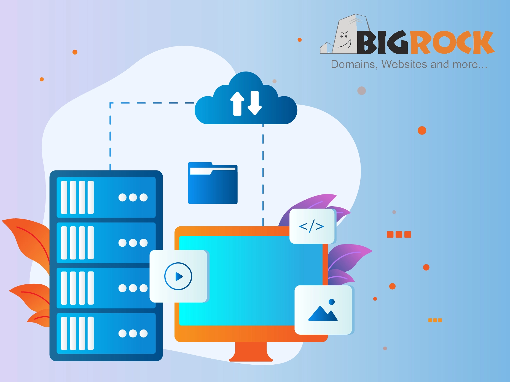

# 9家2025年印度最佳云主机服务：稳定部署，全球覆盖

你是不是也遇到过这种情况：网站托管在单台服务器上，突然宕机了，整个业务就瘫痪了。这种感觉，就像你开着车突然没油了一样尴尬。

其实解决办法很简单——云主机。它把你的网站内容分散存储在多台服务器上，就算其中一台出问题，其他服务器立刻接管。网站照常运行，访客完全感觉不到异常。

今天我们盘点9家在印度提供优质云主机服务的平台。它们都在印度和全球设有数据中心，管理界面简单易用，更重要的是——价格透明，没有隐藏费用。

---

## 什么是云主机？为什么它比传统主机更靠谱

云主机说白了就是一个服务器网络。你的网站数据不是只存在一个地方，而是分布在多台相互连接的服务器上。每台服务器都配备了CPU、内存、存储和带宽。

最关键的优势在于：一台服务器挂了，其他服务器立刻顶上。你的网站24小时在线，访客随时都能访问。

有人可能会问，这和专用服务器有什么区别？很简单：专用服务器就是把所有鸡蛋放在一个篮子里，而云主机是把鸡蛋分散在多个篮子里。哪个更安全，一目了然。

---

## 2025年印度9家顶级云主机提供商

下面按顺序介绍这9家云主机服务商。每一家我们都会详细说明它的核心功能、适用场景和价格方案。你可以根据自己的需求来选择。

**快速导航：**

1. **BigRock** - 综合实力最强的印度云主机
2. **DigitalOcean** - 开发者友好型云服务器
3. **Hostinger** - 性价比之选
4. **ScalaHosting** - 新手入门首选
5. **InMotionHosting** - 功能丰富，价格合理
6. **HostGator** - 最易上手的云服务器
7. **Kamatera** - 无限定制，灵活扩展
8. **Vultr** - 全球高性能云平台
9. **HostArmada** - 预算有限的最佳选择

---

### 1. BigRock：印度本土最强云主机

BigRock是印度本土的云主机龙头，专门服务企业、个人和开发者。它的优势在于价格合理、功能齐全，能帮你快速搭建和扩展在线业务。

BigRock提供完善的数据安全工具，支持频繁备份和快照功能。万一出问题，数据恢复非常快。此外还提供独立IP、私有服务器配置和内置DDoS防护，让你的服务器固若金汤。

它的计费方式也很灵活——按小时计费。你用多少资源就付多少钱，对于流量波动大的项目特别划算。如果你正在寻找一个可靠的印度本土云主机，👉 [这里有一个全球覆盖、性能强劲的替代方案值得考虑](https://www.vultr.com/?ref=9738262-9J)，它在多个国家部署了数据中心，响应速度和稳定性都很出色。

**核心功能：**

- 99.99%的正常运行时间保证，配备Varnish缓存技术加速页面加载
- 支持云主机和VPS的无缝扩展，无需重启服务器即可升级CPU和内存
- 提供cPanel控制面板，轻松管理主机账户、邮箱和域名
- 采用NVMe SSD存储技术，数据冗余存储在多台服务器上
- 一键安装WordPress、Joomla、Drupal等常用应用

**价格方案：**

- 入门款（₹479/月）：1个网站，25GB SSD空间，无限带宽，2GB内存，2核CPU，最多75个邮箱账户
- 进阶款（₹599/月）：50个网站，50GB SSD空间，4GB内存，4核CPU，无限带宽
- 企业款（₹839/月）：100个网站，100GB SSD空间，无限带宽，6GB内存，6核CPU

---

### 2. DigitalOcean：开发者的最爱

DigitalOcean专为开发者打造，以简单易用、价格透明、灵活扩展著称。无论你是搭建个人项目还是AI应用，DigitalOcean都能提供稳定的云基础设施。

它不只是提供硬件资源，还提供完整的开发工具链。性能、可扩展性、技术支持，一个都不少。

DigitalOcean的设计理念是让复杂操作变简单，你可以把全部精力放在开发上，而不是折腾服务器配置。

**核心功能：**

- Droplets虚拟机：快速部署、管理和扩展应用，自由选择CPU、内存和存储配置
- Kubernetes服务：简化容器管理，轻松部署和扩展容器化应用
- GPU Droplets：搭载NVIDIA GPU（包括最新的H100），专为AI和机器学习任务设计
- 托管数据库：支持MySQL、PostgreSQL、MongoDB，自动备份、自动扩展、内置安全防护
- 负载均衡器：优化流量分配，确保全球用户都能快速访问
- 对象存储和块存储：对象存储适合托管大量图片和视频，块存储提供高性能可扩展存储

---

### 3. Hostinger：高性价比的明智之选

Hostinger的AI增强型云主机功能强大且易于使用。它提供灵活、快速、可靠的解决方案，特别适合需要根据流量弹性扩展的网站。

Hostinger承诺99.99%的正常运行时间，还有30天退款保证，让你无后顾之忧。

凭借十多年的主机技术经验，Hostinger已经成为全球数百万用户信赖的品牌。

**核心功能：**

- 采用HTTP协议、NVMe存储和独立IP，页面加载速度提升4倍
- 每日自动备份，一键恢复网站数据
- 印度本地数据中心，保证99.9%在线时间
- AI驱动的网站构建器，支持拖拽式设计，配备AI SEO工具、热力图和文案生成功能
- 每个套餐都包含无限免费SSL证书和带宽
- 24小时在线客服支持，随时解决技术问题
- 一键升级服务器资源（内存、CPU、存储空间），轻松应对流量增长

---

### 4. ScalaHosting：新手友好的云主机平台

ScalaHosting提供功能丰富的云主机平台，专注于可扩展性和易管理性（通过自家的sPanel控制面板）。

它强调灵活扩展，让各种规模的企业都能根据实际需求定制主机方案，同时保持高性能和高安全性。

ScalaHosting提供自管理和托管式云主机服务。用户可以通过sPanel完全控制服务器的各个方面，这个控制面板比传统cPanel更简单直观。

**核心功能：**

- 按需升级资源，只为实际使用的部分付费。无论是CPU、内存还是存储，一键调整配置
- SPanel免费控制面板，简化云管理。界面清晰，管理文件、数据库、邮箱账户无需任何技术背景
- 99.95%正常运行时间保证，数据在多台服务器间冗余存储，硬件故障时自动切换到健康节点
- 10Gbps冗余网络，多链路上行，确保快速稳定的数据传输
- 在美国和欧洲设有多个数据中心，通过AWS合作伙伴可选更多位置，减少延迟，改善用户体验
- 自管理服务器30秒内完成配置，几乎即时可用。提供完整的服务器管理工具
- 支持多种应用，从Apache、Nginx等Web服务器到MariaDB等数据库，以及各类PHP框架

---

### 5. InMotionHosting：功能全面，价格厚道

InMotion Hosting提供优质的云主机解决方案，满足各种商业需求。平台设计注重可扩展性、灵活性和高性能，非常适合托管关键业务应用和网站。

InMotion的云服务承诺99.90%正常运行时间，提供DDoS防护和易用的管理工具。用户既能完全控制主机环境，又能享受稳固的安全保障和技术支持。

**核心功能：**

- 100%云可用性，具备自动故障转移和硬件冗余。任何硬件故障时，系统自动切换到备用硬件
- 高度可扩展，用户可以随时增减CPU、内存和存储资源以应对流量高峰，按需付费
- 免费DDoS防护，保护网站免受DDoS攻击，确保即使遭受攻击也能保持在线
- 提供用户友好的管理工具，包括cPanel和一键式网站及资源管理工具
- 完整的root访问权限，允许高级用户完全自定义服务器设置
- 内置顶级硬件，确保快速加载时间，可处理高流量和资源需求
- 自动备份选项，定期备份数据，发生意外丢失或损坏时可轻松恢复

---

### 6. HostGator：最容易上手的云服务器

HostGator提供快速且可扩展的云主机，适合任何规模的网站。它主打速度和性能，采用SSD驱动的服务器和预集成缓存，确保网站达到最佳性能。

作为主机行业的知名品牌，HostGator的云主机套餐非常适合需要灵活性、安全性和高流量处理能力的企业。

结合云计算能力和共享主机的简便性，HostGator为各个级别的用户提供无缝体验。

**核心功能：**

- 使用NVMe SSD存储，读写速度比传统硬盘快得多，缩短页面加载时间
- 一键轻松升级CPU、内存和存储等网络资源。网站流量激增或需要更多资源时，HostGator的可扩展套餐快速无缝升级
- 内置优化缓存，加快服务器速度，缩短页面加载时间，改善用户体验
- HostGator处理所有服务器管理工作，包括配置、打补丁和快速维护，让你专注于业务发展
- 每个云主机套餐都包含免费SSL证书，保护数据安全并提升SEO排名
- 提供业界领先、易用的cPanel，轻松管理域名、邮箱账户、文件和数据库
- 全天候支持团队，随时帮助解决任何问题或技术故障

---

### 7. Kamatera：无限定制的灵活云平台

Kamatera以灵活性、可扩展性和强大基础设施闻名，是印度顶级免费云主机提供商之一。

凭借超过20年的经验，Kamatera满足寻求可定制、高性能云解决方案的企业和开发者需求。它的云平台提供从简单云服务器到复杂解决方案的广泛服务，全部通过直观的控制面板或API管理。

用户可以轻松升级CPU、内存和存储，确保只为需要的部分付费。Kamatera还强调可用性和可靠性，在全球设有数据中心，提供最低延迟和99.95%的正常运行时间保证。

该平台为新用户提供30天免费试用，让你在没有任何初始财务承诺的情况下探索其功能。这使其成为各种规模企业的理想选择，尤其是资源需求多变的企业。想要在印度之外获得更多数据中心选择和更快的部署速度？👉 [这个全球云平台可能更适合需要跨区域部署的项目](https://www.vultr.com/?ref=9738262-9J)，它在亚洲、欧洲、美洲都有节点，延迟更低。

**核心功能：**

- 用户可以轻松上下扩展服务器资源。无论需要增加CPU、内存还是存储，Kamatera的云平台都能提供满足各种需求的灵活解决方案
- 提供用户友好的管理控制台，简化服务器配置。API支持无缝集成，让技术用户更好地控制服务器
- Kamatera在北美、欧洲、亚洲和中东拥有超过23个数据中心，保证全球用户低延迟，能在更靠近终端用户的地方部署应用
- 没有固定定价！用户可以选择按月付费或基于小时计费的按使用付费模式，只为消耗的资源付费，随时可以取消订阅
- 提供全天候客户支持（电话、在线聊天和邮件），确保用户随时获得帮助
- 云防火墙、安全私有网络和数据加密等功能保护用户数据和应用
- 支持超过100种操作系统选项，可立即部署。还提供负载均衡模块、扩展备份和完全托管服务等附加组件

**价格方案：**

价格因配置而异，可根据实际需求灵活调整。建议先试用30天免费方案，再决定正式套餐。

---

### 8. Vultr：全球高性能云平台

Vultr是一个提供多样化网络服务的云主机平台，满足各种计算需求。以高性能、可扩展性和全球覆盖闻名，Vultr提供Cloud Compute、裸机服务器和Cloud GPU等多种解决方案。

这些服务设计灵活高效，满足从个人开发者到大型企业的需求，提供强大可靠的基础设施。

Vultr还允许用户安排定期备份并创建实例快照，提供额外的数据保护和恢复层。

Vultr提供灵活的网络功能，如独立IP、私有网络和DDoS防护，帮助保护和自定义网络。采用小时计费方案，用户只为消耗的资源付费。这种灵活性适合工作负载多变或短期需求的项目。

**核心功能：**

- 高频云计算基础设施提供更高性能和更快速度，非常适合需要更快页面响应时间的项目
- 为满足更大计算需求，Vultr提供配备专用高性能处理器的优化云计算服务器，可处理要求苛刻的工作负载
- Vultr的裸机服务器为单租户提供高性能计算资源，用户完全控制环境
- 专为特殊工作负载设计，Vultr的Cloud GPU服务器提供强大功能和灵活性
- Vultr在全球拥有超过32个数据中心，其中印度有一个，让用户能在更靠近目标受众的地方部署应用
- 提供广泛的操作系统选择，包括CentOS、Debian、Ubuntu等流行Linux发行版，以及Windows和FreeBSD
- Vultr简单的控制面板提供各种功能的便捷访问，还提供强大的API供用户自动化和管理服务器

---

### 9. HostArmada：预算有限者的首选

HostArmada是一家领先的云主机提供商，专注于基于云的解决方案，强调速度、安全性和可靠性。

服务器内置最先进的云技术，为用户提供高效的主机服务。

他们的云服务包括共享主机、VPS主机、经销商主机和专用CPU主机，全方位满足客户的多样化需求。

HostArmada注重卓越的客户服务和用户友好的环境，是那些希望建立强大网络存在的人的热门选择。

**核心功能：**

- 网站加载速度是关键的SEO排名因素！HostArmada的服务器提供快速加载时间，改善用户体验并提升搜索引擎排名
- 可靠性是HostArmada服务的核心！承诺99.9%正常运行时间保证，确保托管网站保持可访问
- 实施多层安全协议保护主机环境。基于AI的安全服务可适应各种恶意攻击
- 技术支持团队全天候24/7提供服务，随时帮助客户解决问题
- 提供多样化的价格方案，满足不同需求。价格灵活性使其适合初创企业、小企业和大型企业
- 为改善用户体验，HostArmada提供由cPanel支持的简单控制面板，用户无需丰富技术知识即可轻松管理网站

---

## 总结

选择合适的印度云主机解决方案能让你的业务更上一层楼。云主机提供的灵活性、可扩展性和可靠性，正是当今数字世界所必需的。

从Kamatera到HostGator这样的主流平台，再到各种本地提供商，选择非常多。选择时要考虑可扩展性、性能、安全性、客户支持、价格和合规性等因素，确保主机需求得到全面满足。

说到底，选对云主机提供商是你能做出的最佳决策之一。它能让你的企业充分利用云技术的潜力，带来显著的业务优势。如果你需要一个在全球范围内都能提供稳定服务的云平台，👉 [不妨试试这个在32个国家都有数据中心的选择](https://www.vultr.com/?ref=9738262-9J)，部署速度快，管理界面友好，非常适合有国际业务的团队。
